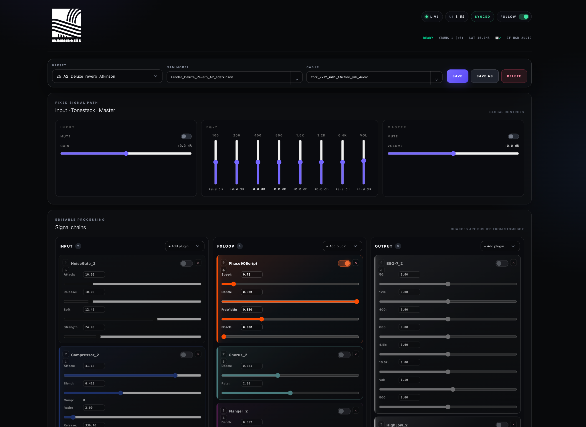
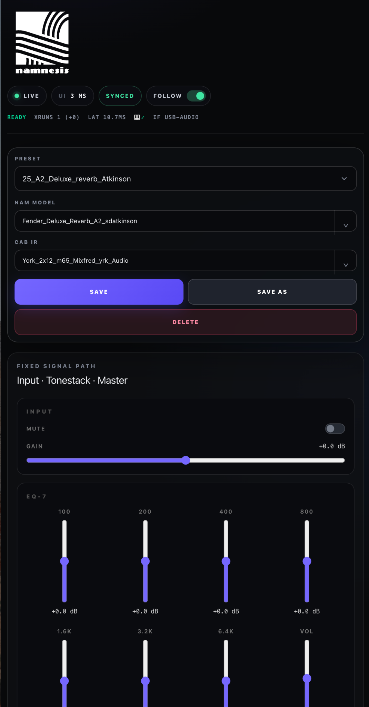

SPDX-License-Identifier: GPL-3.0-or-later

<p align="left">
  
</p>

# NAMNESIS UI Gateway

NAMNESIS UI Gateway is the browser control plane for the NAMNESIS dedicated Neural Amp Modeler instrument. It translates HTTP requests into the textual Stompbox TCP control protocol and presents the current amplifier, cabinet, effects, preset and host status as a touch-friendly control surface.

It does **not** process audio and it does **not** own DSP state. Stompbox remains authoritative. The gateway keeps only an ephemeral, read-only mirror of Stompbox state so that every observer can share one synchronized control stream.

## v0.4.2 architecture

```text
                         ┌──────── Browser / phone ────────┐
                         │  cache reads + SSE state events  │
                         └──────────────┬───────────────────┘
                                        │ HTTP/SSE
                              ┌─────────▼─────────┐
                              │ UI Gateway v0.4.2 │
                              │ observer cache    │
                              │ command serializer│
                              └──────┬───────┬────┘
                                     │       └──── OLED / diagnostics
                          one serialized TCP stream
                                     │
                              ┌──────▼──────┐
                              │  Stompbox   │  ← sole DSP authority
                              └──────┬──────┘
                                     │ JACK realtime graph
```

The previous interface rebuilt every page state by issuing `Dump Config`, `Dump Program` and `List Presets` repeatedly. LIVE mode and the OLED also requested their own `Dump Program` snapshots. v0.4 replaces that fan-out with:

- one shared Stompbox observer cache;
- one serialized TCP control path;
- `Dump Config` caching because plugin metadata is effectively static;
- a configurable `Dump Program` observer loop (250 ms by default);
- Server-Sent Events (SSE) only when the authoritative payload changes;
- immediate cache synchronization after preset, model, IR, plugin and chain mutations;
- stale-while-error behavior so a transient control failure does not erase the working UI.

## Responsiveness model

- `GET /api/state` is cache-only and performs no Stompbox TCP request.
- Browser refreshes are pushed through `/api/events`; no 300 ms browser polling loop remains.
- Changes made in this UI use one command and, where required, one authoritative `Dump Program` synchronization.
- Changes arriving from MIDI or another Stompbox client are detected within the configured program poll interval plus the duration of one `Dump Program` response.

The default target for externally initiated changes is therefore approximately **250 ms + one program-dump duration**, rather than several complete three-command refresh cycles. The exact result must be measured on the physical NAMNESIS host.

## UI capabilities

- Preset load, save, save-as and delete
- NAM model, cabinet IR and convolution reverb selection
- Input gain, master and plugin parameter editing
- Plugin enable/disable
- Chain reordering and plugin release
- Responsive desktop, tablet and phone layouts
- Stable searchable selectors for large NAM/IR libraries
- Preset-backed recovery when Stompbox omits NAM model metadata
- Follow/manual synchronization modes
- Connection, XRUN, MIDI, interface and latency status
- Shared OLED state without extra Stompbox polling
- Raw and parsed diagnostic endpoints

## Requirements

- Go 1.24.4 or the version declared in `go.mod`
- Stompbox TCP control server
- A trusted LAN/VPN; the gateway has no built-in authentication or TLS

## Build

```bash
go build -buildvcs=false ./cmd/namnesis-ui-gateway/
```

The frontend assets are committed. Node.js is required only when rebuilding Tailwind assets.

## Runtime configuration

The server is configured through environment variables, normally in `/etc/namnesis-ui-gateway.env`:

```ini
LISTEN_ADDR=0.0.0.0:3000
STOMPBOX_HOST=127.0.0.1
STOMPBOX_PORT=24639
DIAL_TIMEOUT=1s
READ_TIMEOUT=5s
MAX_BYTES=2000000
PROGRAM_POLL_INTERVAL=250ms
CONFIG_REFRESH_INTERVAL=10m
PRESET_REFRESH_INTERVAL=30s
SSE_HEARTBEAT_INTERVAL=15s
STOMPBOX_PRESET_DIRS=/opt/namnesis/Stompbox/build-current/Presets,/opt/namnesis/Stompbox/build/Presets
ALLOWED_SUBNETS=192.168.1.0/24
```

Open `http://namnesis.local:3000/ui` after starting the service.

## Main endpoints

```text
GET  /api/state                 cached complete state
GET  /api/events                SSE state-change stream
POST /api/state/refresh         explicit program/config/preset refresh
GET  /api/program               cached raw program (?fresh=1 bypasses cache)
GET  /api/dumpconfig            cached raw config  (?fresh=1 bypasses cache)
GET  /api/presets               cached preset list (?fresh=1 bypasses cache)
GET  /api/system                host/JACK/MIDI observability
```

## Realtime isolation

The gateway is not a realtime process. On the NAMNESIS host it should remain on the operating-system cores, outside the isolated JACK/Stompbox DSP set. For the current 6-core layout, use `CPUAffinity=0 1 2 3` in the gateway service while JACK, Stompbox and the USB audio IRQ remain on cores 4–5.

## Safety and security

The Stompbox control protocol has no authentication or encryption. Do not expose the gateway directly to the public Internet. Use the existing subnet allowlist, a firewall and a VPN/reverse proxy where remote access is required.

## Documentation

- `docs/ROADMAP.md` — prioritized next improvements
- `docs/INSTALL.md` — deployment and rollback
- `docs/CONFIG.md` — environment and observability configuration
- `docs/PROTOCOL.md` — Stompbox protocol notes

## License and attribution

GPL-3.0-or-later. Stompbox and its DSP architecture are the work of Mike Oliphant and remain separate from this gateway.


## Web interface

<table>
  <tr>
    <td width="72%">
      
    </td>
    <td width="28%">
      
    </td>
  </tr>
  <tr>
    <td align="center"><sub>Desktop control surface</sub></td>
    <td align="center"><sub>Responsive mobile layout</sub></td>
  </tr>
</table>

